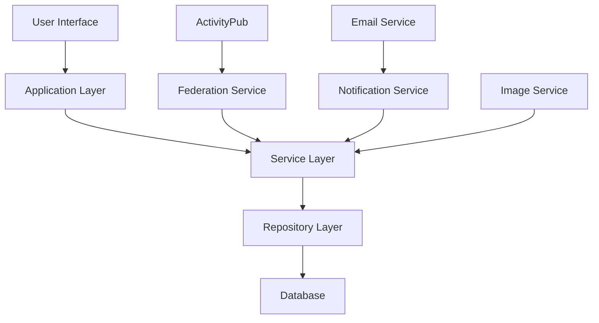
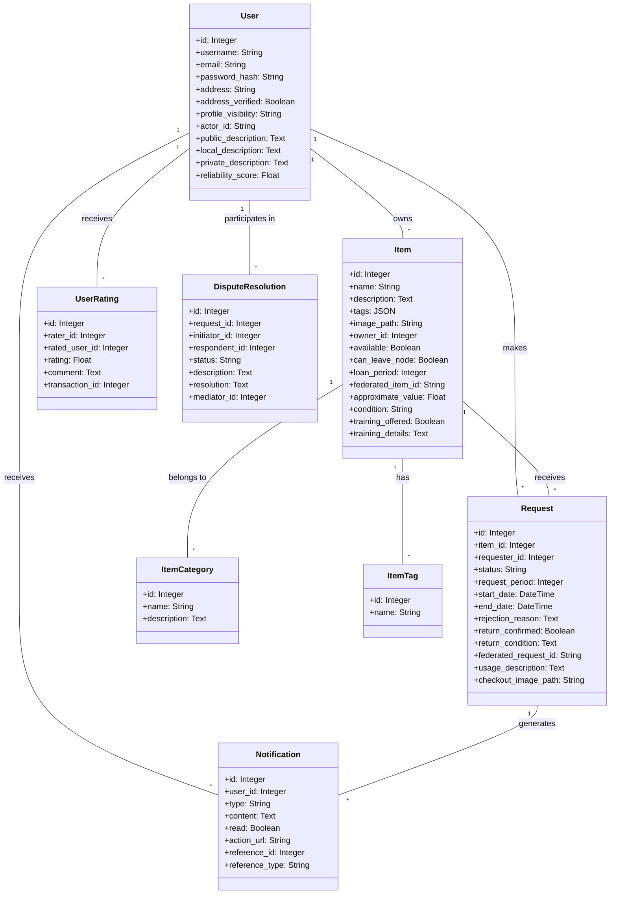

# NeighborGoods: Library of Things Design

This document outlines the design for a comprehensive library system for durable goods that aligns with the NeighborGoods vision. The system builds on the existing codebase while ensuring all requirements from the README are met.

## System Architecture

## Data Model

## Key Components

### 1. Enhanced User Profiles
- Add public, local, and private description fields as specified in the README
- Implement reliability score based on transaction history
- Add profile visibility settings (public, local, private)

### 2. Comprehensive Item Management
- Add fields for approximate value, condition, and training details
- Implement categorization system for better organization
- Support for item images and detailed descriptions
- Track item history and usage statistics

### 3. Request and Borrowing System
- Enhanced request workflow with clear status transitions
- Support for checkout process with condition documentation (photos)
- Return process with condition verification
- Usage description field for borrowers to explain their intended use

### 4. Dispute Resolution System
- Implement the dispute resolution process described in the README
- Support for community mediation
- Track unresolved disputes and late returns on user profiles
- Provide tools for users to resolve disputes amongst themselves

### 5. Federation Capabilities
- Enhance the existing ActivityPub integration
- Support for cross-node borrowing when allowed
- Synchronization of user reputation across nodes

### 6. Notification System
- Automatic reminders for due dates
- Notifications for requests, approvals, and returns
- System alerts for potential issues

### 7. Search and Discovery
- Advanced search with filters for distance, age of post, utilization
- Tag-based browsing and recommendations
- Category-based organization

## User Flows

### Setup and Onboarding
1. Server administrator runs containerized setup
2. Setup wizard guides through initial configuration
3. Users register with minimal required information
4. Users can immediately browse available items

### Offering an Item
1. User logs in and navigates to "Add Item"
2. User provides item details, photos, loan period, etc.
3. User specifies if training is offered and if item can leave the node
4. Item is published and becomes available in search

### Requesting an Item
1. User searches for needed items or posts a request
2. System shows matching available items
3. User selects an item and submits a request with usage description
4. Owner receives notification and can approve/reject

### Borrowing Process
1. Owner approves request
2. System facilitates meetup by sharing necessary contact information
3. At meetup, borrower takes checkout photo documenting condition
4. Owner confirms handoff in the system
5. System tracks loan period and sends reminders
6. Borrower returns item and owner confirms return

### Dispute Resolution
1. If item is damaged/lost, owner marks it in the system
2. Users attempt to resolve the issue directly
3. If needed, community mediation can be requested
4. Resolution is recorded and affects user reputation

## Implementation Recommendations

1. **Extend Existing Models**:
   - Add new fields to User, Item, and Request models
   - Create new models for Categories, Tags, Ratings, and Disputes

2. **Enhance Services**:
   - Add dispute resolution service
   - Expand notification service for reminders
   - Improve federation service for cross-node borrowing

3. **Improve User Interface**:
   - Create intuitive flows for all processes
   - Implement mobile-friendly design
   - Add image upload and management

4. **Security Enhancements**:
   - Secure storage of user data
   - Privacy controls for user information
   - Verification processes for user identity

5. **Community Features**:
   - Ratings and reviews system
   - Community forums for discussion
   - Volunteer mediator program
